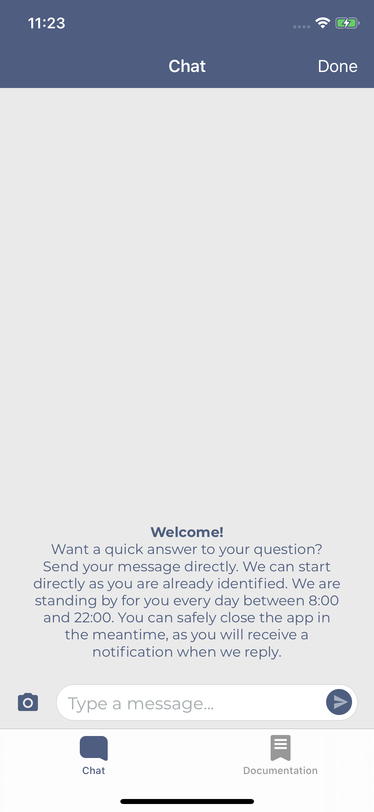
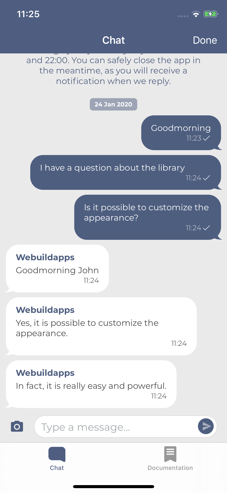
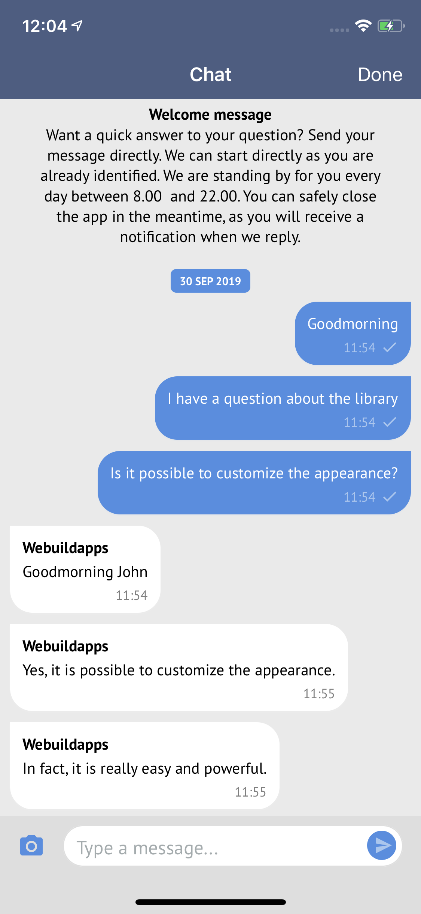
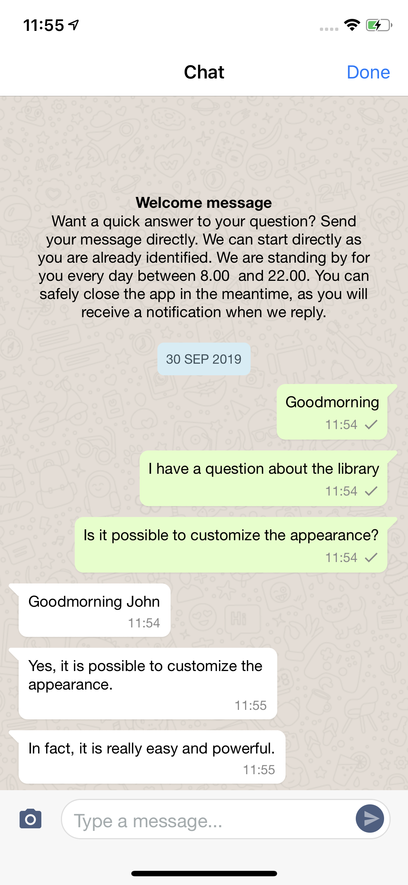

# Parley Messaging iOS library

Easily setup a secure chat with the Parley Messaging iOS library. The Parley SDK allows you to fully customize the chat appearance and integrate it seamlessly in your own app for a great user experience.

*Pay attention: You need an `appSecret` to use this library. The `appSecret` can be obtained by contacting [Parley](https://www.parley.nu/).*

## Screenshots

Empty | Conversation
-- | --
 | 

## Features

- Chat: Send and receive text messages by using Parley.
- Images and gifs: Send and receive images, including gifs, within the chat.
- Messages with actions: Provide custom action buttons, allowing the user to choose from a set of actions.
- Carousel messages: Sending carousel messages as an agent when using rich messaging.
- Nested messages: Carousel messages support the same features as other messages inside the chat.
- Answer Suggestions: Agents can provide reply suggestions for users when using rich messaging.
- Custom styling: Fully change the styling of the chat to match your brand. All elements can be styled based on your preference.
- Accessibility: Full support for VoiceOver and Dynamic Type for a more accessible experience.

## Requirements

- iOS 13.0+
- Xcode 15+
- Swift 5.9+

**Firebase**

For remote notifications Parley relies on Google Firebase. Configure Firebase (using the [installation guide](https://firebase.google.com/docs/ios/setup)) if you haven't configured Firebase yet.

## Installation

### Swift Package Manager

The Swift Package Manager is a tool for automating the distribution of Swift code and is integrated into the swift compiler.

Once you have your Swift package set up, adding Parley as a dependency is as easy as adding it to the dependencies value of your Package.swift.

```
dependencies: [
    .package(url: "git@github.com:parley-messaging/ios-library.git", .upToNextMajor(from: "4.1.x"))
]
```

The modules that are available:

- `Parley` **Required**: 
  The core of Parley and is always needed.
- `ParleyNetwork` **Optional**: 
  This is a standard provided network implementation of Parley which uses Alamofire to handle network requests. 
  When not including ParleyNetwork, you'll need to provide your own network implementation (see [Advanced - Network layer](#network-layer)). 

### Upgrading

Checkout [CHANGELOG.md](CHANGELOG.md) for the latest changes and upgrade notes.

## Getting started

Follow the next steps to get a minimal setup of the library.

### Step 1: Add the `ParleyView` to a *ViewController*

The `ParleyView` can be initialized manually or directly from the Storyboard.

**Manual**

Open the *ViewController* and add the following import:

```swift
import Parley
```

Create an instance of the Parley view (for example) in the `viewDidLoad`.

```swift
override func viewDidLoad() {
  super.viewDidLoad()

  let parleyView = ParleyView()
  parleyView.frame = self.view.frame

  self.view.addSubview(parleyView)
}
```

**Storyboard**

Add a view to the View Controller, select the `Show the Identity inspector` tab and change the `Custom Class` section to:

```
Class: ParleyView
Module: Parley
```

### Step 2: Configure Parley

Configure Parley with your `appSecret` with `Parley.configure(_ secret: String)` (for example in your *ViewController* from step 1).

```swift
Parley.configure("appSecret")
```

*Replace `appSecret` by your Parley `appSecret`. The `appSecret` can be obtained by contacting [Parley](https://www.parley.nu/).*

*Note: calling `Parley.configure()` twice is unsupported, make sure to call `Parley.configure()` only once for the lifecycle of Parley.*

### Step 3: Configure Firebase

Parley needs the FCM token to successfully handle remote notifications.

**FCM Token**

After retrieving an FCM token via your Firebase instance, pass it to the Parley instance in order to support remote notifications. This is can be done by using `Parley.setPushToken(_:)`.

```swift
Parley.setPushToken("pushToken")
```

**Other push types**

```swift
Parley.setPushToken("pushToken", pushType: .customWebhook)
Parley.setPushToken("pushToken", pushType: .customWebhookBehindOAuth)
Parley.setPushToken("pushToken", pushType: .fcm) // Default
```

**Handle remote notifications**

Open your `AppDelegate` and add `Parley.handle(_ userInfo: [AnyHashable: Any])` to the `didReceiveRemoteNotification` method to handle remote notifications.

```swift
extension AppDelegate : UNUserNotificationCenterDelegate {

    func application(_ application: UIApplication, didReceiveRemoteNotification userInfo: [AnyHashable : Any], fetchCompletionHandler completionHandler: @escaping (UIBackgroundFetchResult) -> Void) {
        _ = Parley.handle(userInfo)
    }

    func userNotificationCenter(_ center: UNUserNotificationCenter, willPresent notification: UNNotification, withCompletionHandler completionHandler: @escaping (UNNotificationPresentationOptions) -> Void) {
        if UIApplication.applicationState == .active {
            completionHandler([]) // Do not show notifications when app is in foreground
        } else {
            completionHandler([.alert, .sound])
        }
    }
}
```

### Step 4: Camera usage description

Add a camera and photo library usage description to the `Info.plist` file.

```xml
<key>NSCameraUsageDescription</key>
<string>We need access to the camera to take photos.</string>
<key>NSPhotoLibraryUsageDescription</key>
<string>We need access to the photo library to select photos.</string>
```

### Step 5: Add the certificate of the chat API

By default, Parley applies Public Key Pinning on every request executed to the chat api. The certificate(s) should be added to your project.

You can use the certificates in this repository when using the default base url:
- `/Example/ParleyExample/Supported Files/_.parley.nu_26-Jun-2023.cer` (Expires at: 27 Jun 2024)
- `/Example/ParleyExample/Supported Files/_.parley.nu_27-May-2024.cer` (Expires at: 28 Jul 2025)

When a certificate is going to expire you can safely transition by adding the new `.cer` to the project. It is important to leave the old `.cer` in the app until after the new one is valid. In the next release the old certificate can be removed.

*More information about Public Key Pinning can be found on the website of [OWASP](https://www.owasp.org/index.php/Certificate_and_Public_Key_Pinning).*

## Advanced

Parley allows the usage of advanced configurations, such as specifying the network, specifying the user information or enabling offline messaging. In all use cases it is recommended to apply the advanced configurations before configuring the chat with `Parley.configure(_ secret: String)`.

### Network configuration

The network configuration can be set by setting a `ParleyNetworkConfig` with the `Parley.configure(_ network: ParleyNetwork)` method.

```swift
let headers: [String: String] = [
    "Custom-Header": "Custom header value"
]
let networkConfig = ParleyNetworkConfig(
    url: "https://api.parley.nu/",
    path: "clientApi/v1.7",
    apiVersion: .v1_7,
    headers: headers
)
Parley.configure("appSecret", networkConfig: networkConfig)
```

*Don't forget to add the right certificate to the project.*

### Network layer

The standard `ParleyNetwork` implementation relies on Alamofire as a dependency which is included in the `ParleyNetwork` module.

Parley suppports providing a custom network layer, by doing so you can remove the `ParleyNetwork` module dependency and implement your own.

Create your own network session by adhering to the `ParleyNetworkSession` protocol:

```swift
class CustomNetworkSession : ParleyNetworkSession {
    func request(_ url: URL, data: Data?, method: ParleyHTTPRequestMethod, headers: [String : String], completion: @escaping (Result<ParleyHTTPDataResponse, ParleyHTTPErrorResponse>) -> Void) -> ParleyRequestCancelable {
        // ...
    }
    
    func upload(data: Data, to url: URL, method: ParleyHTTPRequestMethod, headers: [String : String], completion: @escaping (Result<ParleyHTTPDataResponse, ParleyHTTPErrorResponse>) -> Void) -> ParleyRequestCancelable {
        // ...
    }
}
```

Next, configure Parley with the created network session:

```swift
let networkSession = CustomNetworkSession()
Parley.configure("appSecret", networkConfig: networkConfig, networkSession: networkSession)
```

### User information

The chat can be identified and encrypted by applying an authorization token to the `Parley.setUserInformation(_ authorization: String)` method. The token can easily be generated on a secure location by following the _[Authorization header](https://developers.parley.nu/docs/authorization-header)_ documentation.

```swift
let authorization = "ZGFhbnw5ZTA5ZjQ2NWMyMGNjYThiYjMxNzZiYjBhOTZmZDNhNWY0YzVlZjYzMGVhNGZmMWUwMjFjZmE0NTEyYjlmMDQwYTJkMTJmNTQwYTE1YmUwYWU2YTZjNTc4NjNjN2IxMmRjODNhNmU1ODNhODhkMmQwNzY2MGYxZTEzZDVhNDk1Mnw1ZDcwZjM5ZTFlZWE5MTM2YmM3MmIwMzk4ZDcyZjEwNDJkNzUwOTBmZmJjNDM3OTg5ZWU1MzE5MzdlZDlkYmFmNTU1YTcyNTUyZWEyNjllYmI5Yzg5ZDgyZGQ3MDYwYTRjZGYxMzE3NWJkNTUwOGRhZDRmMDA1MTEzNjlkYjkxNQ"

Parley.setUserInformation(authorization)
```

**Additional information**

Additionally, you can set additional information of the user by using the `additionalInformation` parameter in `Parley.setUserInformation()` method. The parameter accepts a `[String: String]` Dictionary.

```swift
let authorization = "ZGFhbnw5ZTA5ZjQ2NWMyMGNjYThiYjMxNzZiYjBhOTZmZDNhNWY0YzVlZjYzMGVhNGZmMWUwMjFjZmE0NTEyYjlmMDQwYTJkMTJmNTQwYTE1YmUwYWU2YTZjNTc4NjNjN2IxMmRjODNhNmU1ODNhODhkMmQwNzY2MGYxZTEzZDVhNDk1Mnw1ZDcwZjM5ZTFlZWE5MTM2YmM3MmIwMzk4ZDcyZjEwNDJkNzUwOTBmZmJjNDM3OTg5ZWU1MzE5MzdlZDlkYmFmNTU1YTcyNTUyZWEyNjllYmI5Yzg5ZDgyZGQ3MDYwYTRjZGYxMzE3NWJkNTUwOGRhZDRmMDA1MTEzNjlkYjkxNQ"

let additionalInformation = [
    kParleyAdditionalValueName: "John Doe",
    kParleyAdditionalValueEmail: "j.doe@parley.nu",
    kParleyAdditionalValueAddress: "Randstad 21 30, 1314, Nederland"
]

Parley.setUserInformation(authorization, additionalInformation: additionalInformation)
```

**Clear user information**

```swift
Parley.clearUserInformation()
```

### Offline messaging

To enable offline messaging, you will have to provide the `ParleyMessageDataSource`, `ParleyKeyValueDataSource` and `ParleyImageDataSource` datasources. These are interfaces you can implement yourself, or use Parley's standard implementations.

Parley provides AES Encrypted implementations, you will have to construct the `ParleyCrypter` with a key, you are free to specify the key size yourself.
Then you can construct each of the dataSources with the `ParleyCrypter`. Optionally, you can specify the `FileManager` and `Directory` for each datasource.
When specifying the directory, it is highly recommended to have different directories for each datasource, not doing so would result in two or more datasources working in the same directory, this could cause overwritten or deleted files.


```swift
do {
    let key = "1234567890123456"
    let crypter = try ParleyCrypter(key: key, size: .bits128)
    let parleyMessageDataSource = try ParleyEncryptedMessageDataSource(crypter: crypter, directory: .default, fileManager: .default)
    let parleyKeyValueDataSource = try ParleyEncryptedKeyValueDataSource(crypter: crypter, directory: .default, fileManager: .default)
    let imageDataSource = try ParleyEncryptedImageDataSource(crypter: crypter, directory: .default, fileManager: .default)
    
    Parley.enableOfflineMessaging(
        messageDataSource: parleyMessageDataSource,
        keyValueDataSource: parleyKeyValueDataSource,
        imageDataSource: imageDataSource
    )
} catch {
    print(error)
}
```

**Disable offline messaging**

```swift
Parley.disableOfflineMessaging()
```

### Send a (silent) message

In some cases it may be handy to send a message for the user. You can easily do this by calling;

```swift
Parley.send("Lorem ipsum dolar sit amet")
```

**Silent**

It is also possible to send silent messages. Those messages are not visible in the chat.

```swift
Parley.send("User opened chat", silent: true)
```

### Referrer

```swift
Parley.setReferrer("https://parley.nu/")
```

### Custom Unique Device Identifier

By default Parley uses a random UUID as device identifier which will be stored in the user defaults. This can be overridden by passing a custom `uniqueDeviceIdentifier` to the configure method:

```swift
Parley.configure("appSecret", uniqueDeviceIdentifier: "uniqueDeviceIdentifier")
```

_When passing the `uniqueDeviceIdentifier` to the configure method, Parley will not store it. Client applications are responsible for storing it and providing Parley with the same ID in this case._

### Reset

Parley doesn't need to be reset usually, but in some cases this might be wanted. For example when a user logs out and then logs in with a different account. 

Resetting Parley will clear the current user information and chat data that is in memory. 
Requires calling the `configure()` method again to use Parley.

```swift
Parley.reset()
```

### Always polling

By default Parley shows messages directly when they are received via push notifications. Therefore Parley only enables polling when needed, which is when the user disabled notifications in their settings. This check could be ignored to always enable polling instead.

```swift
Parley.setAlwaysPolling(true)
```

## Customize

### Callbacks

Parley provides a `ParleyViewDelegate` that can be set on the `ParleyView` for receiving callbacks.

```swift
self.parleyView.delegate = self
```

```swift
extension ChatViewController: ParleyViewDelegate {

    func didSentMessage() {
        debugPrint("ChatViewController.didSentMessage")
    }
}
```

### Appearance

**Images**

Image upload is enabled by default.

```swift
self.parleyView.imagesEnabled = false
```

**Appearance**

Parley provides a `ParleyViewAppearance` that can be set on the `ParleyView` to customize the chat appearance. `ParleyViewAppearance` can be initialized with a regular, italic and bold font which are customizable. Take a look at [ChatViewController.swift](Example/ParleyExample/Controllers/ChatViewController.swift#L32) for an example of how to use the `ParleyViewAppearance`.

```swift
let appearance = ParleyViewAppearance(fontRegularName: "Montserrat-Regular", fontItalicName: "Montserrat-Italic", fontBoldName: "Montserrat-Bold")
appearance.offlineNotification.show = true
appearance.pushDisabledNotification.show = true

parleyView.appearance = appearance
```

#### Examples

Modern | WhatsApp
-- | --
 | 

## License

Parley is available under the MIT license. See the [LICENSE](LICENSE) file for more info.
